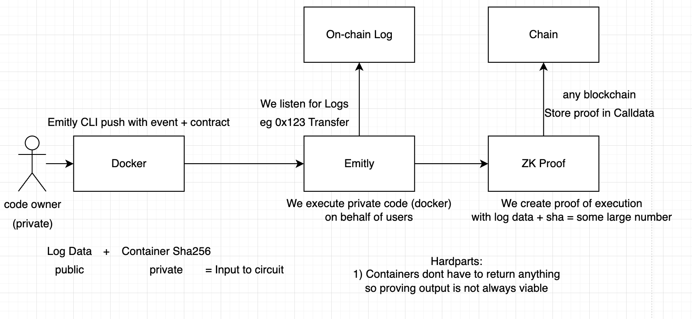

# Playground for creating proofs

`cargo test -- --nocapture`

##### Idea

Executing code in Docker containers and writing a proof to any chain that can be used to verify the container ran as expected. Container code could be anything and may or may not return an output. Could be in any langauge etc. Will always receive an event log from an emitted smart contract event as the input. Will run in the cloud or potentially on decentralized hardware where possible..

